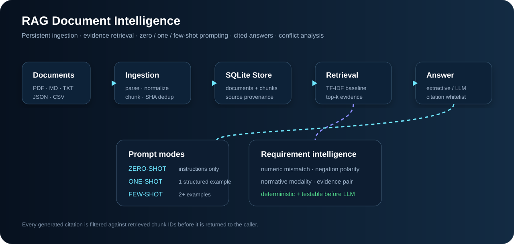
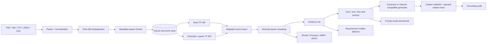

# RAG Document Intelligence

[](https://github.com/cagataykavas/rag-document-intelligence/actions/workflows/ci.yml)

A persistent, evidence-grounded document intelligence service with **multi-format ingestion, hybrid sparse retrieval, zero/one/few-shot prompting, citation integrity checks, quantitative grounding diagnostics, requirement-conflict analysis, retrieval evaluation, REST API and Docker deployment**.



The repository intentionally remains runnable without a paid model API. The default answer path is deterministic/extractive and fully testable. An OpenAI-compatible adapter can be enabled for local or hosted generation when desired.

> Public portfolio implementation only. No employer documents, requirements, proprietary prompts, or confidential datasets are included.

## Why this is more than a chat wrapper

The system separates the parts that are often collapsed into a single “RAG” box:



The inspectable boundaries are explicit:

- **parsing:** file-type-specific normalization, including PDF page markers;
- **persistence:** documents and chunks survive process restarts;
- **idempotent ingestion:** identical content is deduplicated by SHA-256;
- **retrieval:** word and character TF-IDF signals are fused and diversity-reranked;
- **prompting:** zero-shot, one-shot, and few-shot are real code paths;
- **generation:** optional OpenAI-compatible HTTP adapter instead of provider lock-in;
- **citation integrity:** generated citation IDs are checked against retrieved evidence and rejected IDs are preserved for audit;
- **grounding diagnostics:** cited-evidence lexical support is measured separately from citation-ID validity;
- **conflict analysis:** deterministic numeric, negation, and modality checks expose likely requirement contradictions;
- **evaluation:** retrieval, grounding, citation quality, prompt behavior, and latency are measured independently.

## Quick start

```bash
python -m venv .venv
source .venv/bin/activate          # Windows: .venv\Scripts\activate
pip install -r requirements.txt

python -m src.cli ingest ./documents
python -m src.cli query "What authentication rule applies to administrators?"
```

Run the API:

```bash
uvicorn app.api:app --reload
# or
docker compose up --build
```

OpenAPI is exposed at `/docs`.

## Ingestion

### Inline text

```bash
curl -X POST http://localhost:8000/documents/inline \
  -H 'content-type: application/json' \
  -d '{
    "name":"security.md",
    "text":"Administrative endpoints shall require authenticated access. Audit evidence must be retained for seven years."
  }'
```

### File upload

```bash
curl -X POST http://localhost:8000/documents/upload \
  -F 'file=@requirements.pdf' \
  -F 'words_per_chunk=110' \
  -F 'overlap=25'
```

Supported inputs: `.pdf`, `.md`, `.txt`, `.json`, `.csv`.

The store tracks source metadata and SHA-256 content identity. Re-ingesting the same content is idempotent rather than silently duplicating every chunk.

## Hybrid sparse retrieval

The default retriever deliberately does **not** pretend to be a dense embedding system. It fuses two transparent sparse signals:

```text
word TF-IDF:       unigrams + bigrams
character TF-IDF:  3–5 character n-grams

fused_score = 0.65 * word_score + 0.35 * character_score
```

Word features favor lexical/phrase matches. Character features help with requirement IDs, product codes, spelling variation, compound terms, and near-matches. A small document-diversity penalty prevents a single long document from occupying every top-K slot when another relevant source is competitive.

Every retrieval row exposes:

```text
rank
fused score
word score
character score
chunk ID
source document ID
source path
text
```

That makes retrieval behavior debuggable rather than returning an opaque list of “similar chunks.”

## Query with evidence trace

```bash
curl -X POST http://localhost:8000/query \
  -H 'content-type: application/json' \
  -d '{
    "question":"How long must audit evidence be retained?",
    "k":5,
    "prompt_mode":"few_shot",
    "use_llm":false
  }'
```

The response contains:

- answer text;
- accepted citation chunk IDs;
- **rejected/generated citation IDs** that were not retrieved;
- confidence and insufficient-evidence flag;
- full retrieval trace with component scores;
- citation validity + lexical grounding audit;
- prompt mode, generator, and retriever identifiers.

A fluent answer is therefore not allowed to erase how it was produced.

## Citation integrity and grounding audit

`src/grounding.py` treats two different questions separately.

### 1. Did the model cite evidence that actually existed in the retrieval set?

```text
citation_validity_rate = valid generated citation IDs / all generated citation IDs
```

Unknown IDs are excluded from the accepted citation list but remain visible as `rejected_citations`.

### 2. Does the answer have obvious lexical support in its cited chunks?

The project reports a conservative content-token overlap metric called `lexical_grounding_rate`.

This is intentionally labelled as a **diagnostic**, not a factuality or entailment score. Semantic support would require a stronger verifier; simple token overlap should not be marketed as “hallucination detection.”

## Zero-shot, one-shot and few-shot

`src/prompting.py` makes the interview terminology executable:

| Mode | Prompt construction |
| --- | --- |
| `zero_shot` | instructions + evidence + JSON schema |
| `one_shot` | one worked structured example, then live evidence |
| `few_shot` | multiple worked examples, then live evidence |

The examples never supply the answer to the live question. Retrieved evidence remains the source of truth.

The separate `src/prompt_eval.py` harness holds retrieval evidence fixed and compares prompt modes using a supplied generator. This makes it possible to measure whether extra examples actually improve behavior rather than assuming “few-shot is better.”

Per mode it records:

- structured-schema validity;
- generated citation validity;
- insufficient-evidence decision accuracy;
- average confidence;
- prompt size;
- latency.

The generator is injected as a callable, so the same benchmark can exercise a hosted API, local model gateway, or deterministic CI test double.

## Optional LLM wrapper

Set an OpenAI-compatible endpoint:

```bash
export LLM_BASE_URL=http://localhost:11434/v1
export LLM_API_KEY=local
export LLM_MODEL=my-local-model
python -m src.cli query "Summarize the access requirements" --llm --prompt-mode few_shot
```

The adapter requests structured JSON with temperature zero. Generated citation IDs are checked against the retrieved chunk whitelist before they are exposed as accepted citations.

## Retrieval evaluation

`src/evaluate.py` evaluates a labelled query set against an indexed corpus. Retrieval metrics now include:

- **Hit Rate@K**
- **Recall@K**
- **Precision@K**
- **Mean Reciprocal Rank**
- **nDCG@K**

The end-to-end deterministic baseline also reports:

- cited-document accuracy;
- citation-ID validity;
- lexical grounding rate;
- expected-phrase accuracy;
- retrieval + answer latency.

Example:

```bash
python -m src.evaluate \
  --database data/rag.db \
  --cases examples/eval_cases.json \
  --k 5
```

The important design choice is that retrieval evaluation remains separable from generation. A fluent LLM response should not hide a weak retriever.

## Requirement conflict analysis

`src/conflicts.py` implements a deterministic pre-LLM conflict layer. Candidate requirements must first have sufficient lexical overlap, then the system checks:

- **negation polarity:** `shall require` vs `shall not require`;
- **numeric mismatch:** `250 ms` vs `500 ms`;
- **modality mismatch:** `shall/must` vs `may/optional`.

Example API:

```bash
curl -X POST http://localhost:8000/requirements/conflicts \
  -H 'content-type: application/json' \
  -d '{
    "minimum_overlap":0.1,
    "requirements":[
      {"requirement_id":"REQ-1","source":"spec-a","text":"The API shall respond within 250 ms under peak load."},
      {"requirement_id":"REQ-2","source":"spec-b","text":"The API shall respond within 500 ms under peak load."}
    ]
  }'
```

An LLM can later act on the deterministic candidate pairs while keeping both evidence records attached to every judgment.

## Persistent store

SQLite is used as a transparent local persistence boundary:

```text
documents
  doc_id · source · media_type · SHA-256 · metadata

chunks
  chunk_id · doc_id · source · text · ordinal
```

That boundary can be replaced by PostgreSQL/pgvector, OpenSearch, Qdrant, or another retrieval backend without rewriting parsing, prompting, conflict analysis, or evaluation logic.

## Repository map

```text
app/api.py             FastAPI ingestion/query/conflict service
src/parsers.py         document normalization
src/store.py           persistent document/chunk storage
src/retrieval.py       chunking + original sparse baseline
src/hybrid.py          word+character hybrid sparse retrieval
src/grounding.py       citation integrity + lexical support audit
src/prompting.py       zero/one/few-shot prompt construction
src/prompt_eval.py     prompt-mode experiment harness
src/retrieval_eval.py  Hit/Recall/Precision/MRR/nDCG metrics
src/evaluate.py        end-to-end labelled evaluation
src/conflicts.py       deterministic requirement contradictions
src/engine.py          retrieval → evidence → generation orchestration
```

## CI

GitHub Actions runs:

- Ruff over source, API, and tests;
- persistent ingestion/dedup tests;
- hybrid retrieval and ranking metrics;
- citation fabrication/rejection tests;
- zero/one/few-shot evaluation tests;
- requirement-conflict tests;
- REST API tests;
- Docker Compose validation;
- container build.

The default CI path needs no external LLM key.

## Next extensions

- dense embedding retriever + ANN index;
- BM25 + dense reciprocal-rank fusion;
- cross-encoder reranking;
- claim-level citation attribution rather than answer-level lexical support;
- prompt-injection / untrusted-document policy layer;
- page-native PDF provenance;
- Postgres + pgvector / OpenSearch persistence;
- Bedrock, Vertex AI, Azure Foundry, and local-vLLM adapters;
- OpenTelemetry traces across retrieval, generation, and evaluation.

## Interview topics

**RAG · chunking · retrieval evaluation · Recall@K · MRR · nDCG · hybrid retrieval · reranking · zero-shot · one-shot · few-shot · prompt experiments · grounded generation · citation integrity · hallucinated citations · evidence provenance · idempotent ingestion · FastAPI · SQLite · Docker · CI.**
