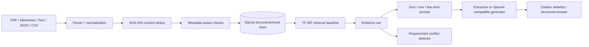

# RAG Document Intelligence

A persistent evidence-grounded document intelligence service with **PDF/Markdown/JSON/CSV ingestion, chunk provenance, sparse retrieval, zero-shot / one-shot / few-shot prompting, citation validation, requirement-conflict analysis, retrieval evaluation, REST API and Docker deployment**.


This repository intentionally works without a paid model API. The default generation path is extractive and fully testable; an OpenAI-compatible adapter can be enabled for a local or hosted LLM when desired.

## Architecture



## Why this is more than a chat wrapper

The inspectable engineering work is separated into explicit boundaries:

- **parsing:** file-type-specific normalization including PDF page markers;
- **persistence:** documents and chunks survive process restarts;
- **idempotent ingestion:** identical content is deduplicated by SHA-256;
- **retrieval:** deterministic TF-IDF baseline is testable without model/network variance;
- **prompting:** zero-shot, one-shot and few-shot modes are explicit code paths;
- **generation:** optional OpenAI-compatible HTTP adapter instead of provider lock-in;
- **grounding:** returned LLM citation IDs are filtered against the actual retrieved evidence IDs;
- **conflict analysis:** deterministic numeric, negation and modality checks expose likely requirement contradictions;
- **evaluation:** retrieval and citation quality can be measured independently of generation.

## Quick start

```bash
python -m venv .venv
source .venv/bin/activate          # Windows: .venv\Scripts\activate
pip install -r requirements.txt

python -m src.cli ingest ./documents
python -m src.cli query "What authentication rule applies to administrators?"
```

Run as a service:

```bash
uvicorn app.api:app --reload
# or
docker compose up --build
```

OpenAPI is available at `http://localhost:8000/docs`.

## REST API

### Ingest inline text

```bash
curl -X POST http://localhost:8000/documents/inline \
  -H 'content-type: application/json' \
  -d '{
    "name":"security.md",
    "text":"Administrative endpoints shall require authenticated access. Audit evidence must be retained for seven years."
  }'
```

### Upload a document

```bash
curl -X POST http://localhost:8000/documents/upload \
  -F 'file=@requirements.pdf' \
  -F 'words_per_chunk=110' \
  -F 'overlap=25'
```

Supported types: `.pdf`, `.md`, `.txt`, `.json`, `.csv`.

### Query

```bash
curl -X POST http://localhost:8000/query \
  -H 'content-type: application/json' \
  -d '{
    "question":"How long must audit evidence be retained?",
    "k":5,
    "prompt_mode":"few_shot",
    "use_llm":false
  }'
```

The response contains the answer, citation chunk IDs, confidence, insufficient-evidence flag, retrieval trace, prompt mode and generator type.

## Zero-shot, one-shot and few-shot

`src/prompting.py` makes the interview terminology executable rather than decorative:

| Mode | Prompt construction |
|---|---|
| `zero_shot` | task instructions + evidence + output schema |
| `one_shot` | one worked structured example before evidence |
| `few_shot` | multiple worked examples before evidence |

The examples do **not** provide the answer to the live question. Retrieved evidence remains the source of truth.

## Optional LLM wrapper

Set an OpenAI-compatible endpoint:

```bash
export LLM_BASE_URL=http://localhost:11434/v1
export LLM_API_KEY=local
export LLM_MODEL=my-local-model
python -m src.cli query "Summarize the access requirements" --llm --prompt-mode few_shot
```

The wrapper requests structured JSON and then removes any generated citation IDs that were not present in the retrieved evidence set. This is a small but important defense against invented citations.

## Requirement conflict analysis

`src/conflicts.py` provides a deterministic pre-LLM conflict layer. It detects candidate contradictions when requirements have sufficient lexical overlap and then checks:

- **negation polarity:** `shall require` vs `shall not require`;
- **numeric mismatch:** `250 ms` vs `500 ms`;
- **modality mismatch:** strong obligation such as `must/shall` vs `may/optional`.

Example API:

```bash
curl -X POST http://localhost:8000/requirements/conflicts \
  -H 'content-type: application/json' \
  -d '{
    "minimum_overlap":0.1,
    "requirements":[
      {"requirement_id":"REQ-1","source":"spec-a","text":"The API shall respond within 250 ms under peak load."},
      {"requirement_id":"REQ-2","source":"spec-b","text":"The API shall respond within 500 ms under peak load."}
    ]
  }'
```

A production extension could use an LLM only after this deterministic candidate-generation stage, keeping the evidence pair attached to every judgment.

## Persistent store

SQLite is used deliberately as a transparent local persistence boundary:

```text
documents
  doc_id · source · media_type · SHA-256 · metadata

chunks
  chunk_id · doc_id · source · text · ordinal
```

The storage adapter can later be replaced by PostgreSQL + pgvector, OpenSearch, Qdrant or another vector backend without rewriting parser/prompt/evaluation behavior.

## Evaluation

`src/evaluate.py` evaluates a labeled query set against an already indexed corpus:

- Recall@K
- Mean Reciprocal Rank
- cited-document accuracy
- expected-phrase accuracy for extractive baselines
- retrieval/answer latency

Generation is deliberately separable from retrieval evaluation. A weak retrieval system should not be hidden behind a fluent LLM response.

## Natural next extensions

- dense embeddings and ANN index;
- BM25 + dense hybrid RRF;
- cross-encoder reranking;
- per-page PDF provenance rather than page markers in text;
- OCR only for scanned PDFs where native extraction is absent;
- answer faithfulness/claim-to-citation evaluation;
- Postgres/pgvector or OpenSearch persistence;
- Bedrock / Vertex AI / Azure Foundry adapters.

## CI

GitHub Actions runs Ruff, persistent-ingestion/retrieval/conflict/API tests, Docker Compose validation and a container build.

All examples are synthetic/public portfolio material. No employer documents, requirements or proprietary datasets are included.
