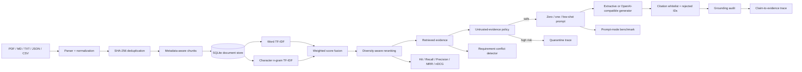

# RAG Document Intelligence

[](https://github.com/cagataykavas/rag-document-intelligence/actions/workflows/ci.yml)

A persistent, evidence-grounded document intelligence service with **multi-format ingestion, hybrid sparse retrieval, zero/one/few-shot prompting, citation integrity checks, claim-to-evidence tracing, untrusted-document quarantine, quantitative evaluation, REST API and Docker deployment**.


The repository intentionally remains runnable without a paid model API. The default answer path is deterministic/extractive and fully testable. An OpenAI-compatible adapter can be enabled for local or hosted generation when desired.

> Public portfolio implementation only. No employer documents, proprietary requirements, confidential prompts, or private datasets are included.

## Architecture



## Why this is more than a chat wrapper

The engineering work is split into boundaries that can be tested independently:

- **parsing:** PDF, Markdown, text, JSON, and CSV normalization;
- **persistence:** documents and chunks survive process restarts;
- **idempotent ingestion:** SHA-256 prevents silent duplicate indexing;
- **retrieval:** transparent word + character sparse fusion with diversity reranking;
- **prompting:** zero-shot, one-shot, and few-shot are explicit code paths;
- **generation:** optional OpenAI-compatible adapter rather than provider lock-in;
- **citation integrity:** generated citation IDs are checked against retrieved evidence;
- **claim support:** answer sentences are mapped back to their strongest cited chunk;
- **untrusted evidence:** instruction-like document content is scanned and high-risk chunks are quarantined from generation;
- **conflict analysis:** deterministic numeric, negation, and modality contradiction checks;
- **evaluation:** retrieval, grounding, prompt behavior, and latency are measured separately.

## Quick start

```bash
python -m venv .venv
source .venv/bin/activate          # Windows: .venv\Scripts\activate
pip install -r requirements.txt

python -m src.cli ingest ./documents
python -m src.cli query "What authentication rule applies to administrators?"
```

Run the service:

```bash
uvicorn app.api:app --reload
# or
docker compose up --build
```

OpenAPI is available at `/docs`.

## Hybrid sparse retrieval

The default retriever deliberately does **not** pretend to be a dense embedding system. It fuses two inspectable sparse signals:

```text
word TF-IDF:       unigrams + bigrams
character TF-IDF:  3–5 character n-grams

fused_score = 0.65 * word_score + 0.35 * character_score
```

Word features favor lexical and phrase matches. Character features improve robustness for requirement IDs, product codes, spelling variation, compound terms, and near-matches. A document-diversity penalty reduces the chance that one long source occupies every top-K slot.

Each retrieval row exposes rank, fused score, component scores, chunk/document IDs, source, and text. Retrieval behavior is therefore inspectable rather than hidden behind an opaque similarity API.

## Query with an evidence trace

```bash
curl -X POST http://localhost:8000/query \
  -H 'content-type: application/json' \
  -d '{
    "question":"How long must audit evidence be retained?",
    "k":5,
    "prompt_mode":"few_shot",
    "use_llm":false
  }'
```

The response contains:

- answer text;
- accepted citation chunk IDs;
- generated-but-rejected citation IDs;
- confidence and insufficient-evidence flag;
- complete retrieval trace with word/character scores;
- citation validity and lexical grounding diagnostics;
- claim-level evidence support rows;
- evidence-policy findings and quarantined chunk IDs;
- prompt mode, generator, and retriever identifiers.

A fluent response cannot erase the evidence path that produced it.

## Citation integrity

Generated citations are validated against the retrieved chunk whitelist.

```text
citation_validity_rate = valid generated citation IDs / all generated citation IDs
```

An invented ID is **not** silently accepted. It is removed from the accepted citation list and preserved in `rejected_citations` for audit and evaluation.

`lexical_grounding_rate` additionally measures content-token overlap between the answer and its cited evidence. This is intentionally labelled a lexical diagnostic, **not** a semantic entailment or hallucination score.

## Claim-to-evidence tracing

`src/claims.py` splits an answer into sentence-like claims and finds the strongest cited chunk for each claim using an inspectable lexical support score.

Example output shape:

```json
{
  "claim": "Audit records must be retained for seven years.",
  "best_chunk_id": "policy:3",
  "lexical_support": 0.91,
  "supported_tokens": ["audit", "records", "retained", "seven", "years"]
}
```

This makes unsupported sentences visible even when the answer as a whole has at least one valid citation. The score is again deliberately not presented as semantic proof.

## Untrusted-document / prompt-injection policy

Retrieved documents are treated as **data, not instructions**.

`src/evidence_policy.py` scans retrieved chunks for transparent instruction-like signals such as:

- “ignore/disregard previous instructions” patterns;
- requests for system/developer prompts;
- credential or secret requests;
- role reassignment language;
- requests to invoke tools, shells, or commands.

High-risk chunks are quarantined from the generation context but remain visible in the retrieval trace and policy findings. Medium-risk findings are surfaced without automatically deleting the evidence.

The prompt itself also explicitly marks evidence as untrusted and wraps chunks in evidence delimiters. The scanner is presented as a **heuristic defense layer**, not a claim of complete prompt-injection detection.

If all relevant evidence is quarantined, the engine refuses to fabricate an answer from it.

## Zero-shot, one-shot, and few-shot

`src/prompting.py` makes the terminology executable:

| Mode | Prompt construction |
| --- | --- |
| `zero_shot` | instructions + evidence + structured output schema |
| `one_shot` | one worked structured example before the live evidence |
| `few_shot` | multiple worked examples before the live evidence |

Examples never contain the answer to the live question. Retrieved evidence remains the factual source of truth.

## Prompt-mode benchmark

`src/prompt_eval.py` holds retrieved evidence fixed and compares zero/one/few-shot behavior using the same generator. This prevents retrieval variance from contaminating the prompt experiment.

Metrics per mode:

- structured-schema validity;
- generated citation validity;
- insufficient-evidence decision accuracy;
- average confidence;
- prompt character cost;
- latency.

With an OpenAI-compatible model configured:

```bash
export LLM_BASE_URL=http://localhost:11434/v1
export LLM_API_KEY=local
export LLM_MODEL=my-local-model

python -m src.cli prompt-benchmark \
  --database data/rag.db \
  --cases examples/prompt_cases.json \
  --k 5
```

Example case format:

```json
[
  {
    "question": "Does the policy require authentication?",
    "expected_insufficient_evidence": false
  }
]
```

The benchmark exists specifically so “few-shot” is an experimental setting rather than an interview buzzword.

## Optional LLM wrapper

```bash
export LLM_BASE_URL=http://localhost:11434/v1
export LLM_API_KEY=local
export LLM_MODEL=my-local-model
python -m src.cli query "Summarize the access requirements" --llm --prompt-mode few_shot
```

The adapter requests structured JSON at temperature zero and applies evidence/citation controls after generation.

## Retrieval evaluation

`src/evaluate.py` evaluates labelled questions against an indexed corpus.

Ranked retrieval metrics:

- **Hit Rate@K**
- **Recall@K**
- **Precision@K**
- **Mean Reciprocal Rank**
- **nDCG@K**

End-to-end deterministic metrics:

- cited-document accuracy;
- citation validity rate;
- lexical grounding rate;
- expected-phrase accuracy;
- retrieval + answer latency.

```bash
python -m src.evaluate \
  --database data/rag.db \
  --cases examples/eval_cases.json \
  --k 5
```

Retrieval evaluation is deliberately independent from LLM fluency. A nice paragraph cannot rescue a retriever that failed to surface the relevant document.

## Requirement conflict analysis

`src/conflicts.py` implements a deterministic pre-LLM contradiction layer. Candidate requirements need sufficient lexical overlap before checks for:

- **negation polarity:** `shall require` vs `shall not require`;
- **numeric mismatch:** `250 ms` vs `500 ms`;
- **modality mismatch:** `shall/must` vs `may/optional`.

This keeps the evidence pair attached to every candidate conflict before any optional LLM reasoning is introduced.

## Persistent store

SQLite is used as a transparent local persistence boundary:

```text
documents
  doc_id · source · media_type · SHA-256 · metadata

chunks
  chunk_id · doc_id · source · text · ordinal
```

The adapter can be replaced with PostgreSQL/pgvector, OpenSearch, Qdrant, or another backend without rewriting parsing, prompting, conflict analysis, or evaluation logic.

## Repository map

```text
app/api.py             FastAPI ingestion/query/conflict service
src/parsers.py         document normalization
src/store.py           persistent document/chunk storage
src/retrieval.py       chunking + original sparse baseline
src/hybrid.py          word+character hybrid sparse retrieval
src/evidence_policy.py untrusted-document risk policy
src/grounding.py       citation integrity + answer-level lexical support
src/claims.py          claim-to-cited-chunk tracing
src/prompting.py       zero/one/few-shot prompt construction
src/prompt_eval.py     prompt-mode experiment harness
src/retrieval_eval.py  Hit/Recall/Precision/MRR/nDCG metrics
src/evaluate.py        labelled end-to-end evaluation
src/conflicts.py       deterministic requirement contradictions
src/engine.py          retrieval → policy → evidence → generation orchestration
```

## CI

GitHub Actions runs without an external LLM key and checks:

- Ruff over source, API, and tests;
- persistent ingestion and SHA-256 deduplication;
- hybrid retrieval and ranking metrics;
- fabricated citation rejection;
- claim-to-evidence tracing;
- prompt-injection quarantine behavior;
- zero/one/few-shot evaluation harness;
- requirement-conflict analysis;
- REST API behavior;
- Docker Compose validation;
- container build.

## Next extensions

- dense embedding retriever + ANN index;
- BM25 + dense reciprocal-rank fusion;
- cross-encoder reranking;
- semantic claim entailment verifier;
- page-native PDF provenance;
- PostgreSQL + pgvector / OpenSearch persistence;
- Bedrock, Vertex AI, Azure Foundry, and local-vLLM adapters;
- OpenTelemetry traces across retrieval, policy, generation, and evaluation.

## Interview topics

**RAG · chunking · hybrid retrieval · reranking · Recall@K · Precision@K · MRR · nDCG · zero-shot · one-shot · few-shot · prompt experiments · grounded generation · citation integrity · claim attribution · prompt injection · untrusted documents · evidence provenance · idempotent ingestion · FastAPI · SQLite · Docker · CI.**
